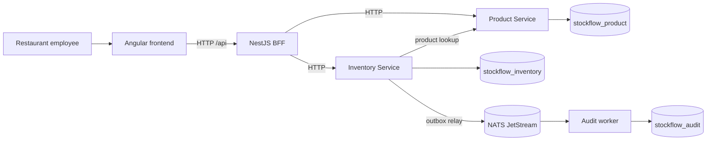

# StockFlow

StockFlow is a small restaurant inventory application built with Angular, a NestJS Backend for Frontend (BFF), Product and Inventory microservices, MongoDB, NATS JetStream, domain-driven design (DDD), and hexagonal architecture.

**Reviewing this repository?** Follow the [company reviewer setup guide](docs/review-guide.md) for prerequisites, installation, startup and the acceptance demo.

**Current state:** all five application projects are implemented. A fresh `npm ci`, build, backend and Angular tests, HTTP contracts, MongoDB transaction/concurrency checks, JetStream/audit checks, and the browser demo passed. The pinned Docker Compose stack was started through WSL; its MongoDB and NATS volumes preserved a record and pending event across `down`/`up`, and the audit worker consumed that event after restart. See [verification evidence](implementation/verification.md).

## What the app does

- Create products with a name, unit, category and low-stock threshold.
- Show each product's current quantity and `OUT`, `LOW` or `OK` status.
- Add or remove stock with a required reason, supporting quantities to three decimal places.
- Show successful stock movements in newest-first order and reject removals that exceed available stock.
- Publish committed stock changes through NATS and persist them through an independent audit worker.

Follow the [app and code walkthrough](docs/walkthrough.md) for the complete 0 → 50 → 40 → rejected 50 kg example. The audit worker has no user-facing audit screen; its records are checked through the verification scripts and MongoDB.

## Architecture



The architecture keeps business rules in the Inventory domain, gives each service ownership of its data, and makes stock events observable through an independent audit worker. The BFF shapes responses for Angular and does not enforce stock rules.

## Why these choices

| Choice | Reason in StockFlow |
| --- | --- |
| Angular and BFF | The employee UI has one typed `/api` boundary; the BFF joins product and balance data for its dashboard. |
| Product and Inventory microservices | Each bounded context owns its rules and MongoDB data; stock changes belong only to Inventory. |
| NestJS | Modules and providers wire controllers to use cases and adapters without putting framework types in the domain. |
| DDD and hexagonal architecture | Inventory rules live in a testable domain model; ports keep persistence and messaging outside the core. |
| MongoDB | An Inventory transaction commits balance, movement and outbox intent together. |
| NATS JetStream and audit worker | A durable asynchronous path records committed stock changes and can recover after a consumer outage. |

## How the code is organized

This is an npm workspace. The two business services keep their domain, application ports/use cases, infrastructure adapters and HTTP presentation separate. NestJS modules connect those layers.

| Path | Responsibility |
| --- | --- |
| `apps/frontend` | Angular screens, forms, routing and typed BFF client |
| `apps/bff` | NestJS frontend API and Product/Inventory response aggregation |
| `apps/product-service` | Product domain, use cases and Product MongoDB repository |
| `apps/inventory-service` | Stock domain, transactions, movements, outbox and NATS publisher |
| `apps/audit-worker` | NestJS application context, durable event consumer and audit repository |
| `packages/contracts` | Shared HTTP and event types; business rules stay in their owning service |
| `packages/primitives` | Pure quantity and UUID helpers; its prepare script builds the runtime package during installation |
| `scripts` | Infrastructure setup, boundary/link checks and integration verifiers |
| `docs` / `implementation` | System documentation, build phases and recorded verification |

The [technology guide](docs/technology-guide.md) maps all eight required technologies and patterns to source files. The [walkthrough](docs/walkthrough.md) shows how those files collaborate during a request.

## Quick start

Use Node.js 22.16 or later within version 22, npm 10.9.2 or later within version 10, Git, and Docker with Compose v2. `.nvmrc` selects tested Node 22.16.0 and the root manifest declares the supported versions. Docker runs MongoDB and NATS; the five applications run on the host. Ports 3000, 3001, 3002, 4200, 27017, 4222 and 8222 must be available.

```sh
git clone https://github.com/yassin-hakim/stockflow.git
cd stockflow
npm ci
```

Create the four local environment files on Windows, macOS or Linux:

```sh
npm run configure
```

The command copies `.env.example` files only when `.env` is absent and preserves existing configuration. Defaults contain localhost URLs and the three service-owned database names. Actual `.env` files are ignored by Git. No external account, API key or private package registry is required.

Start infrastructure in a shell where Docker is available, then initialize its resources from the repository root:

```sh
docker compose up -d --wait
npm run setup:mongo
npm run setup:nats
```

`setup:mongo` waits until replica set `rs0` has a writable primary before reporting success. If Docker is available only inside WSL, run the Compose command there and run npm commands from PowerShell; see the [Windows/WSL setup](docs/operations.md#windows-with-docker-in-wsl).

Open five terminals in the repository root and run one command in each:

| Process | Command |
| --- | --- |
| Product Service | `npm run dev:product` |
| Inventory Service | `npm run dev:inventory` |
| BFF | `npm run dev:bff` |
| Audit worker | `npm run dev:audit` |
| Angular | `npm run dev:frontend` |

Open [localhost:4200](http://localhost:4200). Product, Inventory and BFF readiness endpoints are `http://localhost:3001/health/ready`, `http://localhost:3002/health/ready` and `http://localhost:3000/health/ready`; each should return HTTP 200. The audit worker should log attachment to `stock-audit`.

The database starts empty. Create **Arabica Coffee**, unit `kg`, category `Coffee`, threshold `5`; add `50`, remove `10`, then attempt to remove `50`. The final balance should stay at `40 kg` with two movements.

## Verification and shutdown

```sh
npm run build
npm test
npm run test -w @stockflow/frontend -- --watch=false
npm run check:boundaries
npm run check:docs
```

With the applications and infrastructure running, `npm run verify:demo` verifies the stock scenario, concurrent updates, MongoDB rows and eventual audit records. See [testing](docs/testing.md) for API, rollback, deduplication and [NATS outage](docs/operations.md#nats-outage-drill) checks. Verifiers create separate test products in the local databases.

Stop host applications with Ctrl+C in their terminals. `docker compose down` stops MongoDB and NATS while preserving their named volumes. This demonstration has no authentication; use the local setup on a trusted machine. Production deployment, access control, clustering and backups are outside its scope.

## Documentation

Start with the [documentation index](docs/README.md) or the [guided walkthrough](docs/walkthrough.md). Detailed guides cover [requirements](docs/requirements.md), [architecture](docs/architecture.md), [DDD and hexagonal boundaries](docs/domain.md), [Angular](docs/frontend.md), [NestJS and BFF](docs/backend.md), [HTTP API](docs/api.md), [MongoDB](docs/persistence.md), [NATS](docs/events.md), [setup and operation](docs/operations.md), and [testing](docs/testing.md). The [implementation guide](implementation/README.md) records the build phases and their acceptance evidence.
