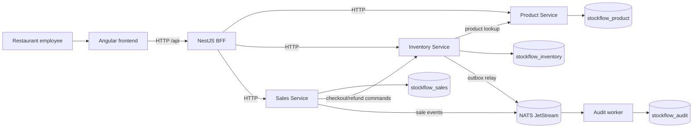

# StockFlow

StockFlow is a restaurant inventory, warehouse operations, menu and point-of-sale application. It is built with Angular, a NestJS Backend for Frontend (BFF), Product, Inventory and Sales services, MongoDB, NATS JetStream, domain-driven design (DDD), and hexagonal architecture.

**Reviewing this repository?** Follow the [company reviewer setup guide](docs/review-guide.md) for prerequisites, installation, startup and the acceptance demo.

**Current state:** the expanded feature set is implemented: product and location management, receiving with unit costs, transfers, waste, physical counts, replenishment, recipes, POS sales and refunds, operational reports, CSV export, and gross-profit reporting. Paginated lists, readable record labels, mobile layouts and recoverable operation requests are included. Source changes are still being checked against the full handoff matrix; see [current expansion evidence](implementation/expansion/verification.md) for the verified scope and any remaining acceptance checks. The original stock-only baseline evidence remains in [baseline verification](implementation/verification.md).

## What the app does

- Create products with a name, unit, category and low-stock threshold.
- Show each product's current quantity and `OUT`, `LOW` or `OK` status.
- Add or remove stock with a required reason, supporting quantities to three decimal places.
- Show successful stock movements in newest-first order and reject removals that exceed available stock.
- Publish committed stock changes through NATS and persist them through an independent audit worker.
- Manage storage locations, suppliers, product details and stock by location; receive deliveries with recorded unit costs, transfer stock, record waste, count stock and review replenishment needs.
- Maintain sellable menu items and versioned ingredient recipes. The POS calculates prices from the menu, commits ingredient consumption with checkout, and records a printable receipt.
- Review sales, cancel uncompleted orders, record partial or full refunds, and explicitly choose whether eligible ingredients return to stock.
- Review inventory activity and sales, ingredient-cost and gross-profit reports with date/location filters, pagination and CSV export. Reports disclose incomplete historical cost data instead of treating unknown costs as zero.

The app records tender labels; it does not connect to payment terminals or gateways. Gross-profit reporting includes sales and ingredient costs, not operating expenses or net-income accounting.

Follow the [app and code walkthrough](docs/walkthrough.md) for the complete 0 → 50 → 40 → rejected 50 kg example. The audit worker has no user-facing audit screen; its records are checked through the verification scripts and MongoDB.

## Architecture



The architecture keeps stock rules in Inventory, catalog and recipe rules in Product, and checkout/refund/report rules in Sales. Each service owns its data. The BFF shapes responses for Angular and does not enforce business rules. NATS carries durable audit events; stock and sale events are recorded by the independent audit worker.

## Why these choices

| Choice | Reason in StockFlow |
| --- | --- |
| Angular and BFF | The employee UI has one typed `/api` boundary; the BFF joins service-owned read models for screens and reports. |
| Product, Inventory and Sales services | Catalog/recipe, stock/location, and sale/report behavior each have a service owner and MongoDB data. Stock changes belong only to Inventory. |
| NestJS | Modules and providers wire controllers to use cases and adapters without putting framework types in the domain. |
| DDD and hexagonal architecture | Inventory rules live in a testable domain model; ports keep persistence and messaging outside the core. |
| MongoDB | An Inventory transaction commits balance, movement and outbox intent together. |
| NATS JetStream and audit worker | A durable asynchronous path records committed stock changes and can recover after a consumer outage. |

## How the code is organized

This is an npm workspace. The Product, Inventory and Sales services keep their domains, application ports/use cases, infrastructure adapters and HTTP presentation separate. NestJS modules connect those layers.

| Path | Responsibility |
| --- | --- |
| `apps/frontend` | Angular screens, forms, routing and typed BFF client |
| `apps/bff` | NestJS frontend API, request validation, service forwarding and read-model composition |
| `apps/product-service` | Product domain, use cases and Product MongoDB repository |
| `apps/inventory-service` | Stock, warehouse operations, valuation, transactions, movements, outbox and NATS publisher |
| `apps/sales-service` | Menu-priced checkout, frozen sale snapshots, refunds, reporting and Sales MongoDB repository |
| `apps/audit-worker` | Durable stock and sale event consumers and audit repositories |
| `packages/contracts` | Shared HTTP and event types; business rules stay in their owning service |
| `packages/primitives` | Pure quantity and UUID helpers; its prepare script builds the runtime package during installation |
| `scripts` | Infrastructure setup, boundary/link checks and integration verifiers |
| `docs` / `implementation` | System documentation, build phases and recorded verification |

The [technology guide](docs/technology-guide.md) maps all eight required technologies and patterns to source files. The [walkthrough](docs/walkthrough.md) shows how those files collaborate during a request.

## Quick start

Use Node.js 22.16 or later within version 22, npm 10.9.2 or later within version 10, Git, and Docker with Compose v2. `.nvmrc` selects tested Node 22.16.0 and the root manifest declares the supported versions. Docker runs MongoDB and NATS; the six application processes run on the host. Ports 3000–3003, 4200, 27017, 4222 and 8222 must be available.

```sh
git clone https://github.com/yassin-hakim/stockflow.git
cd stockflow
npm ci
```

Create the local environment files on Windows, macOS or Linux:

```sh
npm run configure
```

The command copies `.env.example` files only when `.env` is absent and preserves existing configuration. Defaults contain localhost URLs and the three service-owned database names. Actual `.env` files are ignored by Git. No external account, API key or private package registry is required.

Start infrastructure in a shell where Docker is available, then initialize its resources from the repository root:

```sh
docker compose up -d --wait
npm run setup:mongo
npm run setup:nats
```

`setup:mongo` waits until replica set `rs0` has a writable primary before reporting success. If Docker is available only inside WSL, run the Compose command there and run npm commands from PowerShell; see the [Windows/WSL setup](docs/operations.md#windows-with-docker-in-wsl).

Open six terminals in the repository root and run one command in each:

| Process | Command |
| --- | --- |
| Product Service | `npm run dev:product` |
| Inventory Service | `npm run dev:inventory` |
| Sales Service | `npm run dev:sales` |
| BFF | `npm run dev:bff` |
| Audit worker | `npm run dev:audit` |
| Angular | `npm run dev:frontend` |

Open [localhost:4200](http://localhost:4200). Product, Inventory, Sales and BFF readiness endpoints are `http://localhost:3001/health/ready`, `http://localhost:3002/health/ready`, `http://localhost:3003/health/ready` and `http://localhost:3000/health/ready`; each should return HTTP 200. The audit worker should log attachment to the stock and sales audit streams.

The database starts empty. Create **Arabica Coffee**, unit `kg`, category `Coffee`, threshold `5`; add `50`, remove `10`, then attempt to remove `50`. The final balance should stay at `40 kg` with two movements.

## Verification and shutdown

```sh
npm run build
npm test
npm run test -w @stockflow/frontend -- --watch=false
npm run check:boundaries
npm run check:docs
```

With the applications and infrastructure running, `npm run verify:demo` verifies the original stock scenario, concurrent updates, MongoDB rows and eventual audit records. Expansion verifiers and recorded browser/database evidence are listed in the [expansion verification record](implementation/expansion/verification.md). See [testing](docs/testing.md) for API, rollback, deduplication and [NATS outage](docs/operations.md#nats-outage-drill) checks. Verifiers create separate test records in local databases.

Stop host applications with Ctrl+C in their terminals. `docker compose down` stops MongoDB and NATS while preserving their named volumes. This local demonstration has no authentication; use it on a trusted machine. Production deployment, access control, clustering and backups are outside its scope.

## Documentation

Start with the [documentation index](docs/README.md), the [guided walkthrough](docs/walkthrough.md), or the [complete-app expansion plan](implementation/expansion/README.md). Detailed guides cover [requirements](docs/requirements.md), [architecture](docs/architecture.md), [DDD and hexagonal boundaries](docs/domain.md), [Angular](docs/frontend.md), [NestJS and BFF](docs/backend.md), [HTTP API](docs/api.md), [MongoDB](docs/persistence.md), [NATS](docs/events.md), [cost and gross-profit reporting](docs/cost-reporting.md), [setup and operation](docs/operations.md), and [testing](docs/testing.md). The [expansion evidence map](implementation/expansion/requirement-evidence.md) explains which checks passed and what still needs acceptance evidence.
