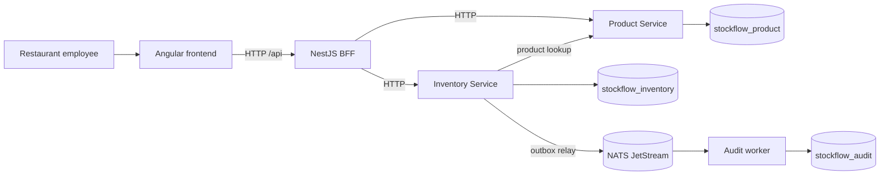

# StockFlow

StockFlow is a deliberately small restaurant inventory system. It demonstrates Angular, a NestJS Backend for Frontend (BFF), Product and Inventory microservices, MongoDB, NATS JetStream, domain-driven design (DDD), and hexagonal architecture.

**Current state:** all five application projects are implemented. A fresh `npm ci`, build, backend and Angular tests, HTTP contracts, MongoDB transaction/concurrency checks, JetStream/audit checks, and the browser demo passed. The pinned Docker Compose stack was started through WSL; its MongoDB and NATS volumes preserved a record and pending event across `down`/`up`, and the audit worker consumed that event after restart. See [verification evidence](implementation/verification.md).

The architecture keeps business rules in the Inventory domain, gives each service ownership of its data, and makes stock events observable through an independent audit worker. The BFF shapes responses for Angular and does not enforce stock rules.

## Why these choices

| Choice | Reason in StockFlow |
| --- | --- |
| Angular and BFF | The employee UI has one typed `/api` boundary; the BFF joins product and balance data for its dashboard. |
| Product and Inventory microservices | Each bounded context owns its rules and MongoDB data; stock changes belong only to Inventory. |
| NestJS | Modules and providers wire controllers to use cases and adapters without putting framework types in the domain. |
| DDD and hexagonal architecture | Inventory rules live in a testable domain model; ports keep persistence and messaging outside the core. |
| MongoDB | An Inventory transaction commits balance, movement and outbox intent together. |
| NATS JetStream and audit worker | A durable asynchronous path records committed stock changes and can recover after a consumer outage. |

Start with the [documentation index](docs/README.md). The [requirements](docs/requirements.md) describe behavior and non-goals; the [architecture](docs/architecture.md) and [API contract](docs/api.md) describe the path. The [implementation guide](implementation/README.md) records the implementation phases and their verification. The [operations guide](docs/operations.md) gives the local startup sequence.

## Workspace and startup

`apps/frontend` is Angular. `apps/bff`, `apps/product-service`, and `apps/inventory-service` are NestJS HTTP applications. `apps/audit-worker` is a NestJS application context. `packages/contracts` contains transport DTOs. Each business service keeps its own domain, application, infrastructure and presentation code.

1. Install Node.js 22 and Docker with Compose. Run `npm ci` and `docker compose up -d --wait`.
2. Initialize or check the MongoDB replica set with `npm run setup:mongo`, then run `npm run setup:nats`.
3. Copy each backend app's `.env.example` to `.env`. Start `npm run dev:product`, `npm run dev:inventory`, `npm run dev:bff`, `npm run dev:audit`, and `npm run dev:frontend` in separate terminals.
4. Open `http://localhost:4200`. Use `npm run build`, `npm test`, `npm run test -w @stockflow/frontend -- --watch=false`, `npm run check:boundaries`, and `npm run check:docs` for local checks. With all processes running, `npm run verify:demo` checks the 50 → 40 → rejected 50 scenario, MongoDB records, and eventual audit rows. The optional [NATS outage drill](docs/operations.md#nats-outage-drill) checks outbox recovery after the broker returns.

The host-process flow was verified against both local executables and the pinned Compose containers. This local demonstration has no authentication and should stay on a trusted machine.

The intended demo creates Arabica Coffee, adds 50 kg, removes 10 kg, shows two movements and two audit events, then rejects a 50 kg removal while the balance remains 40 kg.
