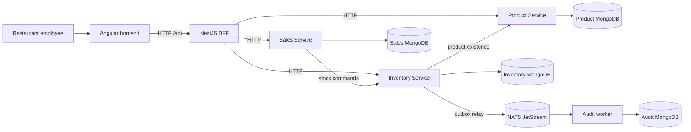

# StockFlow documentation

These files define StockFlow's implemented design. The original five-process inventory baseline is preserved, and the expanded six-process application adds Sales, locations, receiving, recipes, POS, corrections, reports and cost-aware valuation. MongoDB-backed flows, JetStream audit paths and responsive browser workflows are recorded in the [expansion evidence](../implementation/expansion/verification.md). Keep contracts and examples in sync with code.

The separate [implementation guide](../implementation/README.md) breaks this design into architecture, service, page, infrastructure and verification tasks. Its [phase tracker](../implementation/phases/README.md) covers the full build with progress and exit gates.

| Document | Coverage |
| --- | --- |
| [Company reviewer setup](review-guide.md) | Required tools, fresh install, six-process startup and acceptance demo |
| [Fresh-clone review verification](review-verification.md) | Clean dependency install, fresh infrastructure, compiled/development startup and stock-flow results |
| [App and code walkthrough](walkthrough.md) | Employee screens and a complete product/stock/event trace through the actual source |
| [Requirements](requirements.md) | Product scope, non-goals, acceptance and source-spec traceability |
| [Architecture](architecture.md) | Microservices, BFF, boundaries, deployment and end-to-end paths |
| [Technology guide](technology-guide.md) | Project-specific roles of all eight required technologies and patterns |
| [Domain design](domain.md) | DDD, entities, invariants, use cases, ports and hexagonal dependency rules |
| [Frontend](frontend.md) | Angular routes, UI components, state, validation and accessibility |
| [Backend](backend.md) | NestJS modules, BFF, service composition and internal clients |
| [API](api.md) | Public and internal HTTP contracts, DTOs, idempotency and errors |
| [Persistence](persistence.md) | MongoDB databases, collections, indexes, transactions and concurrency |
| [Events](events.md) | NATS JetStream, outbox, relay, consumer and event schema |
| [Operations](operations.md) | Local Docker topology, configuration, startup, health and recovery |
| [Testing and demo](testing.md) | Test layers, acceptance checks and the interview walkthrough |
| [Complete-app expansion plan](../implementation/expansion/README.md) | Implemented warehouse/restaurant operations and recipe-based POS; architecture, contracts, pages and acceptance evidence |

## Technology map

| Required technology or pattern | Primary documentation |
| --- | --- |
| NATS | [Events](events.md), [Operations](operations.md) |
| Microservices | [Architecture](architecture.md), [Backend](backend.md) |
| NestJS | [Backend](backend.md), [API](api.md) |
| Angular | [Frontend](frontend.md) |
| MongoDB | [Persistence](persistence.md) |
| DDD | [Domain design](domain.md) |
| Hexagonal architecture | [Domain design](domain.md), [Architecture](architecture.md) |
| BFF | [Backend](backend.md), [API](api.md) |

## Reading order

For a first run, start with the [root quick start](../README.md#quick-start), then follow the [walkthrough](walkthrough.md). For implementation details, read requirements, architecture, technology guide, domain design, API, and events. The frontend and backend guides explain source structure; persistence, operations, and testing complete the verification path. Official technology references are linked from the relevant guide.

## Receiving costs and gross profit

See [receiving costs, pagination and gross-profit reporting](cost-reporting.md) for the current data rules, endpoints and verification.
