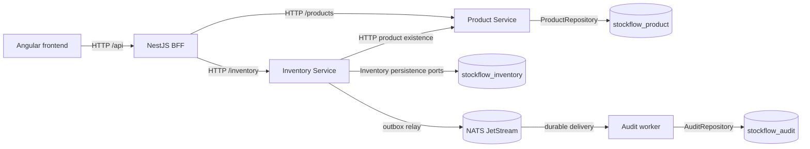

# System architecture

## Context and process view

StockFlow is one frontend, three NestJS HTTP applications, and one event worker. Product and Inventory are the only business bounded contexts. The worker is a consumer, not a third business context.



`apps/frontend` hosts Angular, `apps/bff` hosts the frontend API, `apps/product-service` owns products, `apps/inventory-service` owns inventory and movements, and `apps/audit-worker` consumes events. A single MongoDB server hosts three logically separate databases, each accessed only by its owner in application code. NATS is used only for asynchronous stock events. Synchronous queries and commands use HTTP.

## Ownership and communication

| Process | Responsibility | Allowed outgoing calls |
| --- | --- | --- |
| Frontend | Render dashboard, product creation, stock forms and movement history | BFF HTTP only |
| BFF | Validate HTTP shape, delegate, aggregate products with balances, map frontend responses and errors | Product and Inventory HTTP |
| Product Service | Create/get/list Product and own `stockflow_product` | Its MongoDB database |
| Inventory Service | Enforce stock invariants, record movements, own outbox, publish events | Product HTTP for initial existence check, its MongoDB database, NATS |
| Audit worker | Consume, deduplicate and persist stock events | NATS and its MongoDB database |

The BFF's `OUT`/`LOW`/`OK` label is a display projection from Product threshold and Inventory balance, not an inventory invariant. Inventory alone decides whether a stock change is valid. A product never exposes its MongoDB collection to Inventory.

## Runtime and code boundaries

```text
apps/
├── frontend/
├── bff/
├── product-service/
├── inventory-service/
└── audit-worker/
docs/
docker-compose.yml              # MongoDB replica set and NATS JetStream
```

The two domain services use `src/domain`, `src/application`, `src/infrastructure`, and `src/presentation`. Dependencies point inward: presentation invokes application use cases; application invokes domain objects and ports; MongoDB, HTTP-client and NATS adapters implement ports. NestJS module wiring sits at the outer edge. The domain imports no framework or infrastructure library. See [domain design](domain.md) and [backend design](backend.md).

## Product creation and zero-stock projection

1. Angular sends `POST /api/products` to the BFF; Product Service creates Product in its database.
2. No cross-service database write occurs. The new product has no physical Inventory record yet.
3. On dashboard reads, the BFF left-joins products with Inventory results and projects a missing balance as zero and status `OUT`.
4. On the first add, Inventory Service checks Product Service for existence, creates the inventory row inside its stock transaction, and records the movement and outbox event. An unknown product ID returns `PRODUCT_NOT_FOUND`.

## Stock command and failure paths

```mermaid
sequenceDiagram
  actor Employee
  participant UI as Angular
  participant BFF
  participant I as Inventory Service
  participant P as Product Service
  participant DB as MongoDB transaction
  participant JS as JetStream
  participant A as Audit worker
  Employee->>UI: Add 50 kg
  UI->>BFF: POST /api/inventory/:id/add + Idempotency-Key
  BFF->>I: Forward command and key
  I->>P: Check product if balance is absent
  I->>I: AddStockUseCase -> InventoryItem.addStock
  I->>DB: Commit balance + movement + outbox
  I-->>BFF: Committed result
  BFF-->>UI: Updated balance and movement
  I-->>JS: Relay pending StockAdded; wait for PubAck
  JS-->>A: Deliver event
  A->>A: Upsert eventId; acknowledge after commit
```

Remove uses the same path with `RemoveStockUseCase`, `StockRemoved`, and the removed subject. If quantity is invalid or insufficient, the domain rejects before any commit. If concurrent removals race, version-checked persistence retries the entire use case against the latest balance and returns `INSUFFICIENT_STOCK` when appropriate. If NATS is unavailable after a successful commit, the HTTP command remains successful, its outbox record stays pending, and the relay retries. This separates command success from audit delivery timing while preserving eventual publication. [Events](events.md) defines recovery and duplicate handling.

```mermaid
sequenceDiagram
  actor Employee
  participant UI as Angular
  participant BFF
  participant I as Inventory Service
  participant DB as Inventory MongoDB
  participant JS as JetStream
  participant A as Audit worker
  Employee->>UI: Remove stock
  UI->>BFF: POST /api/inventory/:id/remove + Idempotency-Key
  BFF->>I: Forward command and key
  I->>DB: Load current balance and prior idempotency result
  I->>I: RemoveStockUseCase -> InventoryItem.removeStock
  alt Sufficient stock
    I->>DB: Transaction: balance + movement + pending outbox
    I-->>BFF: Committed result
    BFF-->>UI: Success; refresh overview and history
    I-->>JS: Relay StockRemoved; wait for PubAck
    JS-->>A: Durable delivery
    A->>A: Deduplicated audit write, then acknowledge
  else Insufficient stock
    I-->>BFF: 409 INSUFFICIENT_STOCK
    BFF-->>UI: Show error; refresh balance
    Note over DB,JS: No balance change, movement, outbox row or event
  end
```

## Trace of each user action

| Action | Synchronous path and commit | Asynchronous result |
| --- | --- | --- |
| Create product | Angular form → `POST /api/products` → BFF → Product `CreateProduct` → Product domain validation → `ProductRepository` → `stockflow_product.products`; dashboard left join then shows logical zero | No stock movement, outbox row or NATS event is created by product creation. |
| Add stock | Angular form → BFF add route → Inventory `AddStock` → `Quantity` and `InventoryItem.addStock` → MongoDB transaction writes balance, movement and pending outbox row | Relay publishes `inventory.stock.added`; JetStream delivers `StockAdded`; audit worker writes by event ID, then acknowledges. |
| Remove stock | Angular form → BFF remove route → Inventory `RemoveStock` → `Quantity` and `InventoryItem.removeStock` → same atomic Inventory transaction | Relay publishes `inventory.stock.removed`; JetStream delivers `StockRemoved`; audit worker writes by event ID, then acknowledges. |
| Reject removal | The same HTTP path reaches `InventoryItem.removeStock`, which rejects overdraw with `409 INSUFFICIENT_STOCK`; UI refreshes the balance | No transaction, movement, outbox row, JetStream message or audit record for the rejected request. |

## Why these choices

- **Microservices and DDD:** Product and Inventory have different ownership and rules; only Inventory changes balances. Keep the two contexts explicit instead of adding unrelated services.
- **BFF:** Angular uses one frontend-oriented API; product-plus-stock aggregation stays out of the UI. The BFF remains thin and does not decide stock validity.
- **NestJS:** modules, controllers and dependency injection compose the HTTP boundary and use cases without bringing framework types into the domain.
- **Hexagonal architecture:** service-specific ports let use cases and domain tests run without MongoDB or NATS; concrete adapters remain replaceable.
- **MongoDB:** each owner controls its collections; an Inventory transaction keeps balance, movement and outbox intent together.
- **NATS JetStream:** asynchronous stock events survive a temporarily unavailable consumer and are visible in a separate audit process.
- **Angular:** a small typed client and a few focused screens make the end-to-end flow visible without a direct dependency on internal topology.

The [requirements](requirements.md) define scope, [API](api.md) defines HTTP boundaries, [persistence](persistence.md) defines consistency, and [testing](testing.md) defines the acceptance proof.
