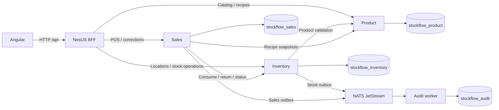

# System architecture

## Context and process view

StockFlow has one Angular frontend, four NestJS HTTP applications (BFF, Product, Inventory and Sales), and one audit worker. Product, Inventory and Sales are the three business bounded contexts. Audit consumes committed notifications; it does not own operational stock or sales.

Each service accesses only its own MongoDB database. Docker Compose provides the single-node MongoDB replica set and NATS; the six applications run as host processes. The expansion is implemented in this checkout; final release acceptance is recorded separately in [expansion verification](../implementation/expansion/verification.md). Earlier [verification](../implementation/verification.md) proves the original five-process inventory baseline.

## Ownership and communication

| Owner | Responsibilities | Outgoing dependencies |
| --- | --- | --- |
| Angular | Catalog, location stock, receiving, transfers, waste, counts, replenishment, menu, POS, receipts, corrections and reports | BFF HTTP only |
| BFF | Boundary validation, forwarding, stable errors, stock/product and report label projections, CSV export | Product, Inventory and Sales HTTP |
| Product | Ingredient identity/SKU/archive, immutable base units, menu prices and recipe revisions | `stockflow_product` |
| Inventory | Locations, all balances, supplier references, receiving, transfers, waste, counts, rules, consumption/return, stock history/outbox | Product HTTP, `stockflow_inventory`, NATS |
| Sales | Priced drafts, frozen attempts, checkout recovery, receipts, refund limits and sales reports/outbox | Product and Inventory HTTP, `stockflow_sales`, NATS |
| Audit | Validated stock v1/v2 and Sales v1 notifications, permanent event-ID deduplication | JetStream and `stockflow_audit` |

The BFF calculates display status from owner-provided quantities and thresholds. It contains no stock mutation, recipe consumption, checkout or refund rule. Product unit remains immutable so historical movements retain meaning. A warehouse is a location within one restaurant, with no separate service or tenant per warehouse.

## Runtime and code boundaries

Product, Inventory and Sales use `domain`, `application`, `infrastructure` and `presentation` layers. Presentation invokes application use cases; application invokes plain domain behavior and service-specific ports; infrastructure implements MongoDB, HTTP and JetStream adapters. NestJS modules perform outer composition. Shared `packages/contracts` contains transport types; `packages/primitives` contains pure numeric/identifier helpers.

## Product creation and zero-stock projection

Product creation writes only Product data. The BFF projects a missing successfully-read balance as zero for a known product. A service failure remains an error. First stock writes create an Inventory balance transactionally after Product validation. `/api/inventory` is the preserved Main Store compatibility surface; `/api/stock?locationId=...` selects a location, while `/api/stock` sums restaurant quantities and returns `locationId:null`.

## Stock command and failure paths

Inventory normalizes the complete command, checks global command-key identity, validates locations/products/supplier references, reads versioned balances, and plans all changes using integer milliunits. One Inventory transaction writes affected balances, document/count state, movement rows, outbox intent and the terminal command result. Transfers have paired removal/addition movements. One insufficient line or transaction failure changes no balance, movement or outbox row. New compound business rejections can retain a rejected command result for recovery; legacy rejected removal remains side-effect free.

After commit, Inventory returns its recorded outcome. Audit arrival does not decide success. The outbox relay publishes separately and resumes after broker recovery. See [persistence](persistence.md) and [events](events.md).

## Sales consistency and recovery

Sales prices a draft from Product snapshots. Checkout checks the reviewed draft version and current catalog configuration, then stores a frozen attempt and `CHECKOUT_PENDING` before contacting Inventory. Inventory consumes the entire ingredient bundle with a persistent operation UUID. Sales records completion, one unique immutable receipt and one Sales event intent in its own transaction. No transaction spans both databases.

A timeout leaves a recoverable pending attempt. Recovery checks Inventory's recorded outcome, then resends the same frozen command/key when necessary. A 404 alone does not establish that an earlier request cannot still commit. Sales scans persisted pending attempts and restock refunds after restart. A refund without restock affects only Sales; a chosen return uses the original Inventory allocation, not the current recipe.

## Trace of each user action

| Action | Owning commit | Notifications |
| --- | --- | --- |
| Edit/archive catalog; publish recipe | Product conditional writes; publication stores an immutable revision | No stock event |
| Receive/transfer/waste/manual change | Inventory local multi-document transaction | One event intent per nonzero stock movement |
| Apply physical count | Count state and balances commit together after version/absence checks | Unchanged quantities create no movement/event |
| Complete checkout | Sales intent, then Inventory consumption, then Sales finalization | Stock movements plus one `SaleCompleted` intent |
| Refund without restock | Sales refund and cumulative counts/money | One `SaleRefunded` intent |
| Refund with restock | Sales intent, bounded Inventory return, Sales finalization | Stock return movements plus one `SaleRefunded` intent |
| Read reports | Owner queries; BFF adds product labels/units | No mutation/event |

## Why these choices

The expanded app retains Angular, NestJS, MongoDB, NATS JetStream, DDD, hexagonal ports and one BFF. Sales is the single added business process because priced orders, refunds and recoverable distributed checkout have distinct ownership. Inventory remains the sole stock authority. Owner-local transactions and durable workflow intent expose intermediate states without claiming distributed atomicity.

See [requirements](requirements.md), [domain](domain.md), [API](api.md), [operations](operations.md) and [testing](testing.md).
