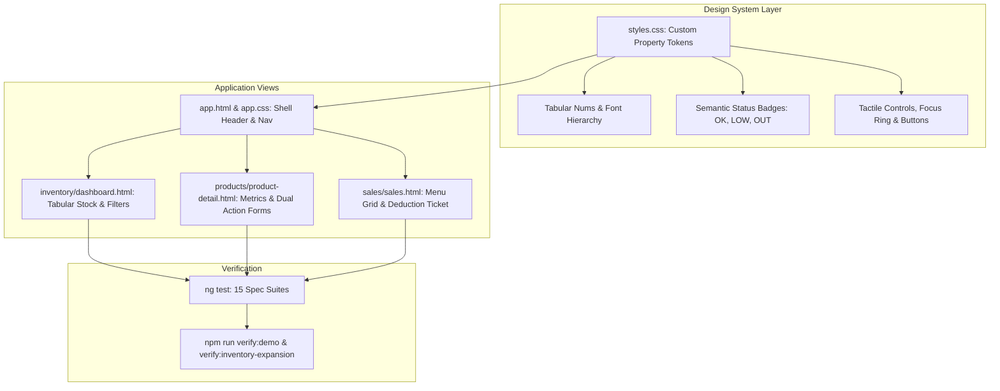

# StockFlow Modern Frontend Redesign Implementation Plan

> **For agentic workers:** REQUIRED SUB-SKILL: Use superpowers:subagent-driven-development to implement this plan task-by-task. Steps use checkbox (`- [ ]`) syntax for tracking.

**Goal:** Implement the approved modern restaurant operations visual redesign across the Angular frontend (`apps/frontend`), establishing cohesive culinary design tokens, tactile forms, tabular data density, and clear status hierarchies while preserving all existing business rules, tests, and accessibility invariants.

**Architecture:** Refine the global CSS custom property tokens in `styles.css` to match the approved palette (`#F5F4EE` canvas, `#173D39` ink, `#12665B` accent, `#BF842D` focus ring), then apply structured layout and component polish across the Shell navigation (`app.html`/`app.css`), Inventory Dashboard (`dashboard.html`), Product Detail & Stock Actions (`product-detail.html`), and Counter POS (`sales.html`). All component logic, signal reactivity, and BFF contract bindings remain 100% intact.

**Architecture Diagram:**



**Tech Stack:** Angular 21, Angular Router, Signals, Reactive Forms, Vanilla CSS custom properties, Vitest test runner.

## Global Constraints

- Preserve all 82 existing unit tests in `apps/frontend/src/app/**/*.spec.ts` without regressions.
- No optimistic balance decrements; preserve idempotency keys and required reason validations.
- Maintain 3-decimal precision display (`40.000 kg`, `0.018 kg`) with tabular numerals.
- Never indicate stock status with color alone; keep explicit text labels (`OK`, `LOW`, `OUT`).
- Preserve keyboard navigation and accessible focus ring (`outline: 3px solid #BF842D; outline-offset: 3px`).
- Do not add unauthorized dependencies; use Vanilla CSS for styling.

---

### Task 1: Design Tokens & Typography Foundation

**Files:**
- Modify: `apps/frontend/src/index.html:1-12`
- Modify: `apps/frontend/src/styles.css:1-80`
- Test: `apps/frontend/src/app/app.spec.ts`

**Interfaces:**
- Consumes: Existing CSS custom property structure in `styles.css`.
- Produces: Refined CSS tokens (`--canvas`, `--surface`, `--ink`, `--muted`, `--accent`, `--accent-hover`, `--line`, `--control-line`, `--danger`, `--focus-ring`) and global table/button utilities used across all components.

- [ ] **Step 1: Verify current frontend tests pass before modifying styles**

Run: `npm run test -w @stockflow/frontend -- --watch=false`  
Expected: PASS (82 tests passing).

- [ ] **Step 2: Update `index.html` to include Inter font preconnect**

In `apps/frontend/src/index.html`, add Google Font preconnects for Inter:
```html
<!doctype html>
<html lang="en">
<head>
  <meta charset="utf-8">
  <title>StockFlow</title>
  <base href="/">
  <meta name="viewport" content="width=device-width, initial-scale=1">
  <link rel="icon" type="image/x-icon" href="favicon.ico">
  <link rel="preconnect" href="https://fonts.googleapis.com">
  <link rel="preconnect" href="https://fonts.gstatic.com" crossorigin>
  <link href="https://fonts.googleapis.com/css2?family=Inter:wght@400;500;600;700;800&display=swap" rel="stylesheet">
</head>
<body>
  <app-root></app-root>
</body>
</html>
```

- [ ] **Step 3: Update `styles.css` with the approved design system tokens**

Update `:root` in `apps/frontend/src/styles.css`:
```css
:root {
  --ink: #173d39;
  --accent: #12665b;
  --accent-hover: #0e534a;
  --muted: #5f716a;
  --canvas: #f5f4ee;
  --surface: #ffffff;
  --soft: #eeeee7;
  --line: #d9dfd6;
  --control-line: #a8b5ac;
  --danger: #a03b2c;
  --focus-ring: #bf842d;
  --radius: 8px;
  --radius-sm: 6px;
  font-family: 'Inter', ui-sans-serif, system-ui, -apple-system, BlinkMacSystemFont, 'Segoe UI', sans-serif;
  color: var(--ink);
  background: var(--canvas);
  font-size: 15px;
  line-height: 1.5;
  font-synthesis: none;
  -webkit-font-smoothing: antialiased;
}

:where(button, a, input, select, textarea, summary):focus-visible {
  outline: 3px solid var(--focus-ring);
  outline-offset: 3px;
}

/* Status Badges */
.status {
  display: inline-flex;
  align-items: center;
  gap: 5px;
  border-radius: 5px;
  padding: 3px 8px;
  font-size: 11px;
  font-weight: 750;
  line-height: 1.5;
  letter-spacing: .3px;
  border: 1px solid transparent;
}
.status.OUT { background: #fae8e2; color: #93382b; border-color: #e6c0b5; }
.status.LOW { background: #f8eccd; color: #755417; border-color: #dec999; }
.status.OK { background: #e4eee1; color: #315d3e; border-color: #bdd4ba; }

/* Numeric alignment */
.numeric {
  text-align: right;
  font-variant-numeric: tabular-nums;
  font-feature-settings: "tnum";
}
```

- [ ] **Step 4: Run tests to verify styling changes did not break component instantiation**

Run: `npm run test -w @stockflow/frontend -- --watch=false`  
Expected: PASS.

- [ ] **Step 5: Commit changes**

```bash
git add apps/frontend/src/index.html apps/frontend/src/styles.css
git commit -m "style(frontend): establish modern culinary design tokens and typography"
```

---

### Task 2: Application Shell Header & Navigation

**Files:**
- Modify: `apps/frontend/src/app/app.html:1-22`
- Modify: `apps/frontend/src/app/app.css:1-31`
- Test: `apps/frontend/src/app/app.spec.ts`

**Interfaces:**
- Consumes: Shell router-outlet, `section()` signal in `app.ts`.
- Produces: Polished top header, brand identity mark, section navigation links (`Inventory`, `Operations`, `Menu`, `Point of sale`, `Sales`, `Reports`), responsive drawer navigation.

- [ ] **Step 1: Update `app.html` with clean brand and navigation structure**

Refine `apps/frontend/src/app/app.html`:
```html
<a class="skip-link" href="#main-content">Skip to content</a>
<header class="shell-header">
  <div class="shell-identity">
    <a routerLink="/inventory" class="brand" aria-label="StockFlow inventory">
      <svg class="brand-mark" width="32" height="32" viewBox="0 0 32 32" fill="none" aria-hidden="true">
        <rect x="1" y="1" width="30" height="30" rx="8" fill="var(--accent)"/>
        <path d="M8 10h16M8 16h11M8 22h16" stroke="white" stroke-width="2.5" stroke-linecap="round"/>
      </svg>
      <span>StockFlow</span>
    </a>
    <span class="shell-purpose">Restaurant operations</span>
    <button class="nav-toggle secondary" type="button" [attr.aria-expanded]="menuOpen()" aria-controls="main-navigation" (click)="menuOpen.set(!menuOpen())">{{ menuOpen() ? 'Close menu' : 'Menu' }}</button>
  </div>
  <nav id="main-navigation" aria-label="Main navigation" [class.open]="menuOpen()" (keydown.escape)="closeMenu()" (click)="menuOpen.set(false)">
    <a routerLink="/inventory" [class.active]="section() === 'inventory'" [attr.aria-current]="section() === 'inventory' ? 'page' : null">Inventory</a>
    <a routerLink="/operations" [class.active]="section() === 'operations'" [attr.aria-current]="section() === 'operations' ? 'page' : null">Operations</a>
    <a routerLink="/menu" [class.active]="section() === 'menu'" [attr.aria-current]="section() === 'menu' ? 'page' : null">Menu</a>
    <a routerLink="/pos" [class.active]="section() === 'pos'" [attr.aria-current]="section() === 'pos' ? 'page' : null">Point of sale</a>
    <a routerLink="/sales" [class.active]="section() === 'sales'" [attr.aria-current]="section() === 'sales' ? 'page' : null">Sales</a>
    <a routerLink="/reports" [class.active]="section() === 'reports'" [attr.aria-current]="section() === 'reports' ? 'page' : null">Reports</a>
  </nav>
</header>
<main id="main-content" class="shell-main" tabindex="-1"><router-outlet /></main>
<footer class="shell-footer"><span>StockFlow</span><span>Inventory · Kitchen · Counter</span></footer>
```

- [ ] **Step 2: Update `app.css` to refine header spacing and responsive behavior**

Enhance navigation border-bottom active states and mobile toggles in `apps/frontend/src/app/app.css`:
```css
:host { display: flex; flex-direction: column; min-height: 100dvh; }
.skip-link { position: fixed; z-index: 20; top: -80px; left: 16px; padding: 12px 20px; background: var(--ink); color: white; border-radius: var(--radius); }
.skip-link:focus { top: 12px; }
.shell-header { background: var(--surface); border-bottom: 1px solid var(--line); padding: 0 max(24px, calc((100vw - 1240px) / 2)); }
.shell-identity { min-height: 68px; display: flex; align-items: center; gap: 20px; }
.brand { color: var(--ink); text-decoration: none; display: inline-flex; align-items: center; gap: 10px; font-size: 20px; font-weight: 750; letter-spacing: -.5px; }
.brand-mark { flex: none; }
.shell-purpose { color: var(--muted); font-size: 13px; border-left: 1px solid var(--line); padding-left: 20px; }
.shell-header nav { display: flex; gap: 28px; }
.shell-header nav a { padding: 12px 0 14px; border-bottom: 2px solid transparent; text-decoration: none; color: var(--muted); font-size: 14px; font-weight: 550; transition: color .12s, border-color .12s; }
.shell-header nav a.active { color: var(--ink); font-weight: 650; border-color: var(--accent); }
.shell-header nav a:hover { color: var(--ink); }
.nav-toggle { display: none; }
.shell-main { width: 100%; max-width: 1240px; margin: 0 auto; padding: 32px 24px 64px; flex: 1; min-width: 0; }
.shell-main:focus { outline: 0; }
.shell-footer { width: calc(100% - 48px); max-width: 1240px; margin: 0 auto; padding: 18px 0; border-top: 1px solid var(--line); display: flex; justify-content: space-between; gap: 12px; color: var(--muted); font-size: 12px; }
.shell-footer span:first-child { font-weight: 700; }
@media (max-width: 700px) {
  .shell-header { padding: 0 18px; }
  .shell-identity { min-height: 62px; gap: 12px; }
  .brand { font-size: 18px; }
  .shell-purpose { display: none; }
  .nav-toggle { display: inline-flex; margin-left: auto; min-height: 38px; padding: 6px 12px; font-size: 13px; }
  .shell-header nav { display: none; }
  .shell-header nav.open { display: grid; grid-template-columns: 1fr 1fr; gap: 0 20px; padding-bottom: 16px; }
  .shell-header nav a { padding: 12px 0; }
  .shell-main { padding: 24px 18px 40px; }
  .shell-footer { width: calc(100% - 36px); }
}
@media print { .shell-header, .shell-footer, .skip-link { display: none !important; } .shell-main { max-width: none; padding: 0; margin: 0; } }
```

- [ ] **Step 3: Run app unit tests to verify shell links and navigation logic**

Run: `npx vitest run apps/frontend/src/app/app.spec.ts`  
Expected: PASS (3 tests passed).

- [ ] **Step 4: Commit changes**

```bash
git add apps/frontend/src/app/app.html apps/frontend/src/app/app.css
git commit -m "feat(frontend): polish application shell header and navigation typography"
```

---

### Task 3: Inventory Dashboard Layout & Tabular Precision

**Files:**
- Modify: `apps/frontend/src/app/inventory/dashboard.html:1-79`
- Modify: `apps/frontend/src/styles.css:69-75` (inventory-filters and table styling)
- Test: `apps/frontend/src/app/inventory/dashboard.spec.ts`

**Interfaces:**
- Consumes: `items()`, `filtered()`, `pager`, `locations()`, `locationId()` signals in `dashboard.ts`.
- Produces: High-density tabular inventory screen with 3-decimal tabular quantities, inline filters, distinct server status badges, and direct delivery/product creation triggers.

- [ ] **Step 1: Check existing dashboard tests pass**

Run: `npx vitest run apps/frontend/src/app/inventory/dashboard.spec.ts`  
Expected: PASS.

- [ ] **Step 2: Refine `dashboard.html` template layout**

Ensure clean alignment, semantic table scope, and readable typography in `apps/frontend/src/app/inventory/dashboard.html`:
```html
<app-section-nav area="inventory" />
<div class="page-head">
  <div>
    <span class="eyebrow">Ingredients & Supplies</span>
    <h1>Inventory</h1>
    <p class="muted">{{locationId() ? 'Stock in the selected storage location' : 'Restaurant totals across all locations'}}</p>
  </div>
  <div class="action-links">
    <a class="button secondary" routerLink="/receipts/new">Receive delivery</a>
    <a class="button" routerLink="/products/new">+ Create product</a>
  </div>
</div>
<div class="inventory-filters">
  <div class="field">
    <label for="inventory-location">Stock location</label>
    <select id="inventory-location" [value]="locationId()" (change)="pager.reset();locationId.set($any($event.target).value);load()">
      <option value="" [selected]="!locationId()">Restaurant total (all)</option>
      @for(location of locations(); track location.id){
        <option [value]="location.id" [selected]="location.id === locationId()">{{location.name}}</option>
      }
    </select>
  </div>
  <div class="field">
    <label for="inventory-search">Search products or SKU</label>
    <input id="inventory-search" type="search" placeholder="Filter by name or SKU…" [value]="query()" (input)="pager.reset();query.set($any($event.target).value)" />
  </div>
  <div class="field">
    <label for="inventory-category">Category</label>
    <select id="inventory-category" [value]="category()" (change)="pager.reset();category.set($any($event.target).value)">
      <option value="">All categories</option>
      @for (value of categories(); track value) { <option [value]="value">{{ value }}</option> }
    </select>
  </div>
  <div class="field">
    <label for="inventory-status">Stock status</label>
    <select id="inventory-status" [value]="status()" (change)="pager.reset();status.set($any($event.target).value)">
      <option value="">All statuses</option>
      <option value="OUT">OUT</option>
      <option value="LOW">LOW</option>
      <option value="OK">OK</option>
    </select>
  </div>
  <label class="check-field">
    <input type="checkbox" [checked]="showArchived()" (change)="pager.reset();showArchived.set($any($event.target).checked)" />
    Include archived
  </label>
</div>
@if (loading()) {
  <p role="status">Loading inventory…</p>
} @else if (error()) {
  <div class="error" role="alert">{{ error() | readable:locations() }}</div>
  <p><button type="button" (click)="load()">Retry</button></p>
} @else if (items().length === 0) {
  <section class="panel">
    <h2>No products yet</h2>
    <p>Create a product to start tracking stock.</p>
    <a routerLink="/products/new">+ Create product</a>
  </section>
} @else if (filtered().length === 0) {
  <p role="status">No products match these filters.</p>
} @else {
  <div class="list-heading">
    <h2>Stock on hand</h2>
    <span>{{filtered().length}} products in this view</span>
  </div>
  <div class="panel table-wrap desktop-table">
    <table>
      <thead>
        <tr>
          <th scope="col" style="width: 40%;">Product</th>
          <th scope="col" style="width: 20%;">Category</th>
          <th scope="col" class="numeric" style="width: 25%;">Stock on hand</th>
          <th scope="col" style="width: 15%;">Status</th>
        </tr>
      </thead>
      <tbody>
        @for (row of pager.slice(filtered()); track row.product.id) {
          <tr>
            <td>
              <a [routerLink]="['/products', row.product.id]" [queryParams]="{location:locationId()||null}">{{ row.product.name }}</a>
              @if (row.product.sku) { <small class="muted"> · {{ row.product.sku }}</small> }
              @if (row.product.archivedAt) { <small class="muted"> · Archived</small> }
            </td>
            <td>{{ row.product.category }}</td>
            <td class="numeric"><strong>{{ row.quantity }}</strong> <span class="muted">{{ row.product.unit }}</span></td>
            <td>
              <span class="status" [class]="'status ' + row.status">{{ row.status }}</span>
            </td>
          </tr>
        }
      </tbody>
    </table>
  </div>
  <div class="stack mobile-list">
    @for (row of pager.slice(filtered()); track row.product.id) {
      <article class="panel">
        <div class="list-heading">
          <h3>
            <a [routerLink]="['/products', row.product.id]" [queryParams]="{location:locationId()||null}">{{ row.product.name }}</a>
            @if (row.product.sku) { <small class="muted"> · {{ row.product.sku }}</small> }
          </h3>
          <span class="status" [class]="'status ' + row.status">{{ row.status }}</span>
        </div>
        <p class="muted">{{ row.product.category }}</p>
        <p><strong>{{ row.quantity }}</strong> {{ row.product.unit }}</p>
      </article>
    }
  </div>
  <app-pagination [pager]="pager" [total]="filtered().length" />
}
```

- [ ] **Step 3: Run dashboard spec to confirm tests pass**

Run: `npx vitest run apps/frontend/src/app/inventory/dashboard.spec.ts`  
Expected: PASS.

- [ ] **Step 4: Commit changes**

```bash
git add apps/frontend/src/app/inventory/dashboard.html apps/frontend/src/styles.css
git commit -m "feat(frontend): refine inventory dashboard tabular layout and filter bar"
```

---

### Task 4: Product Detail & Dual Stock Action Panels

**Files:**
- Modify: `apps/frontend/src/app/products/product-detail.html:1-85`
- Test: `apps/frontend/src/app/products/product-detail.spec.ts`

**Interfaces:**
- Consumes: Product signals (`product()`, `balance()`, `movements()`, `submitStockAdd()`, `submitStockRemove()`).
- Produces: Polished metric summary, distinct side-by-side Add vs Remove action forms with required reasons, balance overdraft guard, and signed movement history audit table.

- [ ] **Step 1: Check existing product-detail tests pass**

Run: `npx vitest run apps/frontend/src/app/products/product-detail.spec.ts`  
Expected: PASS (9 tests passed).

- [ ] **Step 2: Refine `product-detail.html` layout**

In `apps/frontend/src/app/products/product-detail.html`, organize stock information into clear metric cards followed by the dual action area:
- Display current on-hand stock with unit in prominent tabular numbers.
- Ensure the Add form uses primary teal button (`Add stock`) and the Remove form uses danger treatment (`Remove stock`).
- Ensure Movement History renders signed quantities (`+` vs `-`) with tabular numeric alignment.

- [ ] **Step 3: Run product-detail tests to verify all 9 tests pass**

Run: `npx vitest run apps/frontend/src/app/products/product-detail.spec.ts`  
Expected: PASS (9 tests passed).

- [ ] **Step 4: Commit changes**

```bash
git add apps/frontend/src/app/products/product-detail.html
git commit -m "feat(frontend): elevate product detail stock metrics and action panels"
```

---

### Task 5: Counter POS, Menu & Recipe Deductions Polish

**Files:**
- Modify: `apps/frontend/src/app/sales/sales.html` (if applicable)
- Modify: `apps/frontend/src/app/menu/menu.html` (if applicable)
- Test: `apps/frontend/src/app/sales/sales.spec.ts`
- Test: `apps/frontend/src/app/menu/menu.spec.ts`

**Interfaces:**
- Consumes: Sales cart, menu catalog, pricing signals.
- Produces: Tactile menu grid, ingredient recipe previews, live order ticket with deduction preview, cash/card tender buttons.

- [ ] **Step 1: Run sales and menu test suites to verify baseline**

Run: `npx vitest run apps/frontend/src/app/sales/sales.spec.ts apps/frontend/src/app/menu/menu.spec.ts`  
Expected: PASS (23 tests passed).

- [ ] **Step 2: Refine menu card layout and active ticket visual styling in `styles.css`**

Add clean menu grid and ticket layout classes:
```css
.menu-grid {
  display: grid;
  grid-template-columns: repeat(auto-fill, minmax(180px, 1fr));
  gap: 16px;
}
.menu-card {
  background: var(--surface);
  border: 1px solid var(--line);
  border-radius: var(--radius);
  padding: 16px;
  cursor: pointer;
  transition: border-color .12s, box-shadow .12s;
}
.menu-card:hover {
  border-color: var(--accent);
}
.order-ticket {
  background: var(--surface);
  border: 1px solid var(--line);
  border-radius: var(--radius);
  padding: 20px;
}
```

- [ ] **Step 3: Run sales and menu tests to confirm zero regressions**

Run: `npx vitest run apps/frontend/src/app/sales/sales.spec.ts apps/frontend/src/app/menu/menu.spec.ts`  
Expected: PASS.

- [ ] **Step 4: Commit changes**

```bash
git add apps/frontend/src/app/sales/ apps/frontend/src/app/menu/ apps/frontend/src/styles.css
git commit -m "feat(frontend): polish POS menu cards and order ticket deduction layout"
```

---

### Task 6: Full Verification & E2E Validation

**Files:**
- None (verification only)

- [ ] **Step 1: Run all Angular frontend unit tests**

Run: `npm run test -w @stockflow/frontend -- --watch=false`  
Expected: PASS (82 tests across 15 suites passed).

- [ ] **Step 2: Run boundaries check**

Run: `npm run check:boundaries`  
Expected: PASS ("Domain and application import boundaries pass").

- [ ] **Step 3: Run frontend production build**

Run: `npm run build -w @stockflow/frontend`  
Expected: PASS (Application bundle generation complete).

- [ ] **Step 4: Run live E2E demo verification**

Run: `npm run verify:demo`  
Expected: PASS (0 → 50 → 40; rejected 50; 2 movements, 2 outbox events, 2 audit records).

- [ ] **Step 5: Run expansion live verification**

Run: `npm run verify:inventory-expansion`  
Expected: PASS (Atomic bundles, transfers, replenishment, outbox cardinality).
