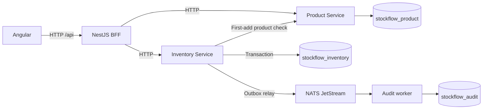

# StockFlow app and code walkthrough

This guide follows a restaurant employee through the implemented app, then traces each action through the source. Start the system using the [root quick start](../README.md#quick-start) or the detailed [setup guide](operations.md). The [technology guide](technology-guide.md) explains each technology with source references; this walkthrough shows how they work together.

## What the employee sees

| Page | Purpose | Angular implementation |
| --- | --- | --- |
| `/inventory` | All products, quantities, units and stock statuses; links to details and creation | [Dashboard](../apps/frontend/src/app/inventory/dashboard.ts) |
| `/products/new` | Create a product with name, unit, category and low-stock threshold | [ProductCreate](../apps/frontend/src/app/products/product-create.ts) |
| `/products/:id` | Current stock, add/remove forms and newest-first movement history | [ProductDetail](../apps/frontend/src/app/products/product-detail.ts) |
| Unknown path | Explain the missing page and link back to inventory | [NotFound](../apps/frontend/src/app/shared/not-found.ts) |

The [router](../apps/frontend/src/app/app.routes.ts) redirects `/` to inventory. The screens use Angular standalone components, reactive forms and signals for view state. Loading messages, retry controls, validation focus, status announcements and mobile layouts are part of the app.

There is no login, product update/delete screen, supplier workflow or audit viewer. The audit worker's MongoDB records and logs demonstrate event consumption independently of the employee UI.

## The running system

Product Service owns what can be stocked. Inventory Service owns balances, stock rules, movements and outbox rows. Both are independently running NestJS HTTP applications. The BFF provides the one API used by Angular and combines the owners' responses. A fifth process, the NestJS audit application context, consumes events.

One MongoDB server hosts three databases, each accessed only by its owner in application code. Docker Compose runs that server as replica set `rs0` and runs NATS with JetStream file storage. It does not run the five application processes.

## 1. Load the inventory dashboard

[BffApi.listInventory](../apps/frontend/src/app/core/bff-api.ts) sends `GET /api/inventory`. Angular's [development proxy](../apps/frontend/proxy.conf.json) sends `/api` to port 3000.

The BFF's [inventory controller](../apps/bff/src/inventory-controller.ts) fetches `GET /products` from Product Service and `GET /inventory` from Inventory Service. [projectInventory](../apps/bff/src/projection.ts) joins them by product ID and sorts by product name. A known product without a stored balance is projected as zero. An unavailable Inventory Service produces an error and a UI retry state.

The BFF computes status: `OUT` at zero, `LOW` for positive stock at or below a positive threshold, otherwise `OK`. Angular displays the returned status.

## 2. Create Arabica Coffee

Open **New product** and enter name `Arabica Coffee`, unit `kg`, category `Coffee`, threshold `5`.

1. [ProductCreate](../apps/frontend/src/app/products/product-create.ts) validates the fields and calls `BffApi.createProduct`.
2. The BFF validates the request shape and forwards `POST /api/products` to Product Service `POST /products`.
3. [ProductController](../apps/product-service/src/presentation/product-controller.ts) converts threshold `5` into `5000` integer thousandths.
4. [CreateProduct.execute](../apps/product-service/src/application/product-use-cases.ts) calls the plain TypeScript [createProduct](../apps/product-service/src/domain/product.ts) domain function to generate identity/timestamps and enforce Product rules.
5. [MongoProductRepository](../apps/product-service/src/infrastructure/mongo-product-repository.ts) saves it in `stockflow_product.products`.

Angular navigates to the created product's detail page. The BFF confirms the Product exists, maps the internal `INVENTORY_NOT_FOUND` response to zero, and returns `OUT`. There is no Inventory row, movement or stock event yet. Product creation writes only Product-owned data.

## 3. Add 50 kg

Enter quantity `50`, reason `Supplier delivery`, then select **Add stock**.

1. [ProductDetail.submit](../apps/frontend/src/app/products/product-detail.ts) generates an idempotency-key UUID and saves the normalized request through [PendingStockCommands](../apps/frontend/src/app/core/pending-stock-commands.ts) before sending it. It locks both submit buttons and calls the typed BFF client. Tab-scoped storage preserves the original command across navigation and refresh.
2. The BFF forwards `POST /api/inventory/:productId/add` to Inventory Service `POST /inventory/:productId/add`, preserving the key.
3. [InventoryController](../apps/inventory-service/src/presentation/inventory-controller.ts) validates UUIDs/body/reason and calls [toMillis](../apps/inventory-service/src/domain/stock.ts): `50 kg` becomes `50000` milliunits.
4. [StockUseCases.change](../apps/inventory-service/src/application/stock-use-cases.ts) first looks up an earlier result by key. It loads the balance and, for this first addition, checks Product through [HttpProductCatalog](../apps/inventory-service/src/infrastructure/product-http-client.ts).
5. `InventoryItem.addStock(command)` enforces a positive safe integer quantity and maximum balance, then creates the next item state, one domain movement and one domain event.
6. `toPersistedChange` maps the domain event's integer amounts to the public version-1 event quantities.
7. [MongoStockStore.commit](../apps/inventory-service/src/infrastructure/mongo-stock-store.ts) commits all three Inventory records in one transaction:

| Collection | Result of this addition |
| --- | --- |
| `inventory` | Balance `quantityMillis: 50000`, version `1` |
| `stock_movements` | One `ADD` movement, normalized command/key and original API result |
| `outbox` | One `PENDING` `StockAdded` envelope with a stable event ID |

The HTTP response reports the committed balance `50` and movement. Angular shows success and refetches the overview and history. With threshold `5`, stock status is `OK`. Audit delivery can finish after the HTTP response.

## 4. Follow the event through NATS

[OutboxRelay](../apps/inventory-service/src/infrastructure/outbox-relay.ts) polls every 500 ms. [PublishPendingEvents.execute](../apps/inventory-service/src/application/publish-pending-events.ts) reads up to 100 due rows and sends each through the `EventPublisher` port.

[NatsEventPublisher.publish](../apps/inventory-service/src/infrastructure/nats-event-publisher.ts) publishes UTF-8 JSON to `inventory.stock.added`, sets the NATS message ID to the stored event ID and waits for JetStream's publish acknowledgment. The relay then marks the outbox row `PUBLISHED`. Publication failures retain the row and schedule a retry.

[setup:nats](../scripts/setup-nats.ts) creates the file-backed `STOCK_EVENTS` stream and durable explicit-acknowledgment pull consumer `stock-audit`. [AuditConsumer](../apps/audit-worker/src/audit.ts) pulls one message, validates it with `parseEvent`, then invokes [HandleStockEvent.execute](../apps/audit-worker/src/application/handle-stock-event.ts).

`MongoAuditRepository.save` inserts `stockflow_audit.stock_events` with `_id = eventId`. An identical duplicate succeeds after comparing its payload; a conflicting payload fails. The consumer acknowledges only after successful storage. This provides a durable application audit record despite repeated deliveries.

## 5. Remove 10 kg, then reject 50 kg

Remove `10` with reason `Restaurant order`. The same command path uses `InventoryItem.removeStock`, commits balance `40000`, records a `REMOVE` movement, and publishes `StockRemoved` on `inventory.stock.removed`. The detail page shows `40 kg`, `OK`, and two successful movements.

Attempt to remove `50` from `40`. The domain rejects the negative result with `INSUFFICIENT_STOCK`, mapped to HTTP 409. Angular shows the message and refreshes stock. The balance remains 40 kg; there is no third movement, outbox event or audit record.

Movement quantities are positive API numbers for both types; the UI adds the displayed `+` or `−` sign. API timestamps are UTC and Angular's DatePipe displays local time.

## How the architecture protects this flow

| Concern | Implemented behavior |
| --- | --- |
| Retry after an uncertain HTTP outcome | Reuse the same key and normalized body; Inventory returns the saved original result. A different command with that key gets `IDEMPOTENCY_CONFLICT`. The stock form preserves the original key while its outcome is uncertain. |
| Concurrent removals | The MongoDB update matches the loaded version. A conflict aborts the transaction; the use case reloads and reruns the rule, up to three attempts. |
| Concurrent first additions | Unique product balance protects first insertion; an insertion race is retried against the new record. |
| NATS outage | Stock can commit with a pending outbox row. The relay catches up after recovery. |
| Worker or audit database outage | The durable consumer retains/redelivers unacknowledged messages. |
| Publish succeeds before the relay crashes | The row may publish again; JetStream message IDs and permanent audit event-ID deduplication protect repeat delivery. |
| MongoDB transaction fails | Balance, movement and outbox changes roll back together. |

## How it was built and where each technology fits

The npm workspace shares transport types through [packages/contracts](../packages/contracts/src/index.ts). Product and Inventory each have inward dependencies: HTTP presentation → application use case → domain and ports. Their concrete adapters live in infrastructure; NestJS modules compose them.

| Technology or pattern | Its role in this app |
| --- | --- |
| Angular | Employee pages, Router, reactive forms, signals and typed HttpClient calls to the BFF |
| BFF | Frontend routes, internal HTTP calls, error mapping and joined dashboard/detail projection |
| Microservices | Separately running Product/Inventory owners with API communication and separate databases; an independent audit consumer |
| NestJS | Backend bootstrapping, controllers, injection tokens/providers and worker lifecycle |
| DDD | Product and Inventory bounded contexts; Product creation rules and InventoryItem stock invariants |
| Hexagonal architecture | Repository, ProductCatalog, StockUnitOfWork, OutboxRepository, EventPublisher and AuditRepository ports with concrete adapters |
| MongoDB | Owner-specific persistence, indexed idempotency/concurrency guards, atomic Inventory transactions and audit deduplication |
| NATS JetStream | Durable asynchronous delivery of committed stock events from Inventory to audit |

The [technology source map](technology-guide.md#source-and-verification-map) links the implementation for all eight entries. [Backend](backend.md), [frontend](frontend.md), [domain](domain.md), [persistence](persistence.md), [API](api.md) and [events](events.md) provide the detailed contracts.

## Reproduce the proof

Run `npm run verify:demo` with the services running. It creates separate test products, checks 0 → 50 → 40 → rejected 50, compares movements/outbox/audit records, and exercises concurrent first additions and removals. `npm run verify:atomicity` proves rollback; `npm run verify:dedup` checks duplicate/conflicting audit payloads.

Follow the [NATS outage drill](operations.md#nats-outage-drill) for broker recovery, and the [testing guide](testing.md) for all acceptance scenarios. The [verification report](../implementation/verification.md) distinguishes executed checks from human screen-reader and separate-machine checks that were not performed.
